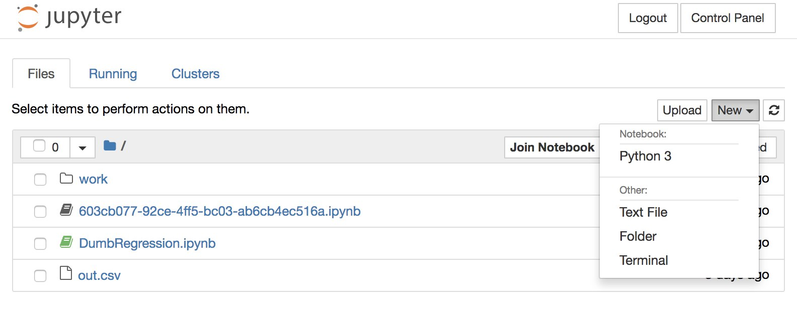
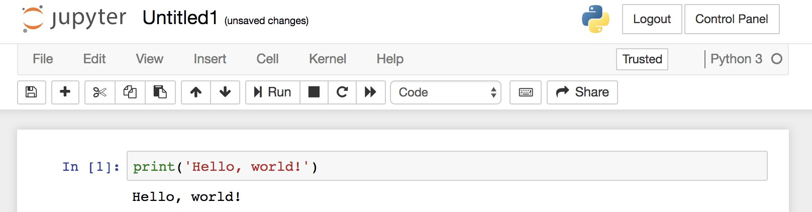
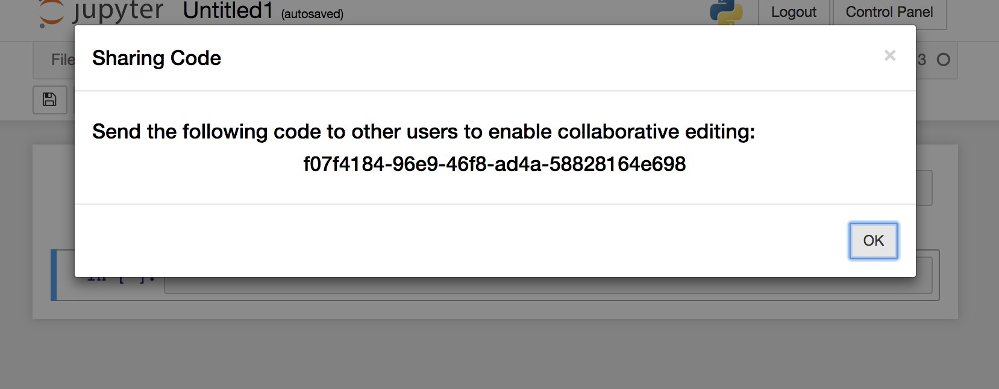
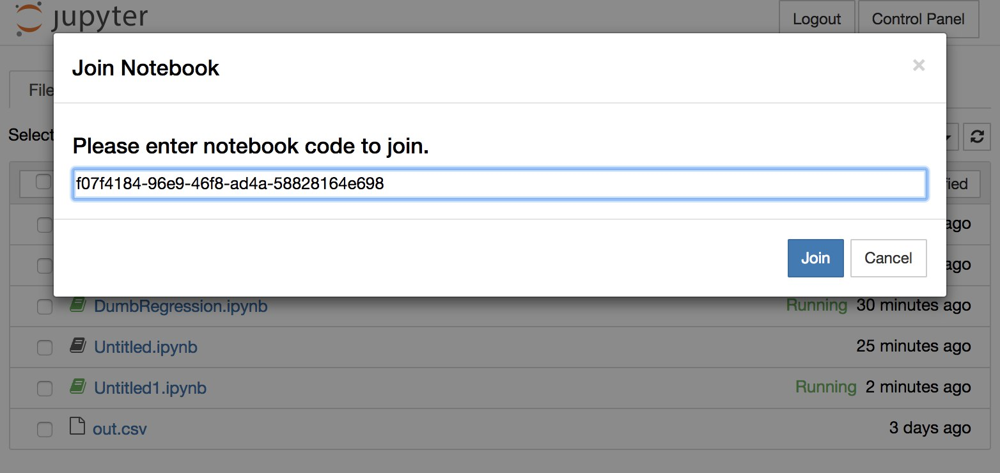
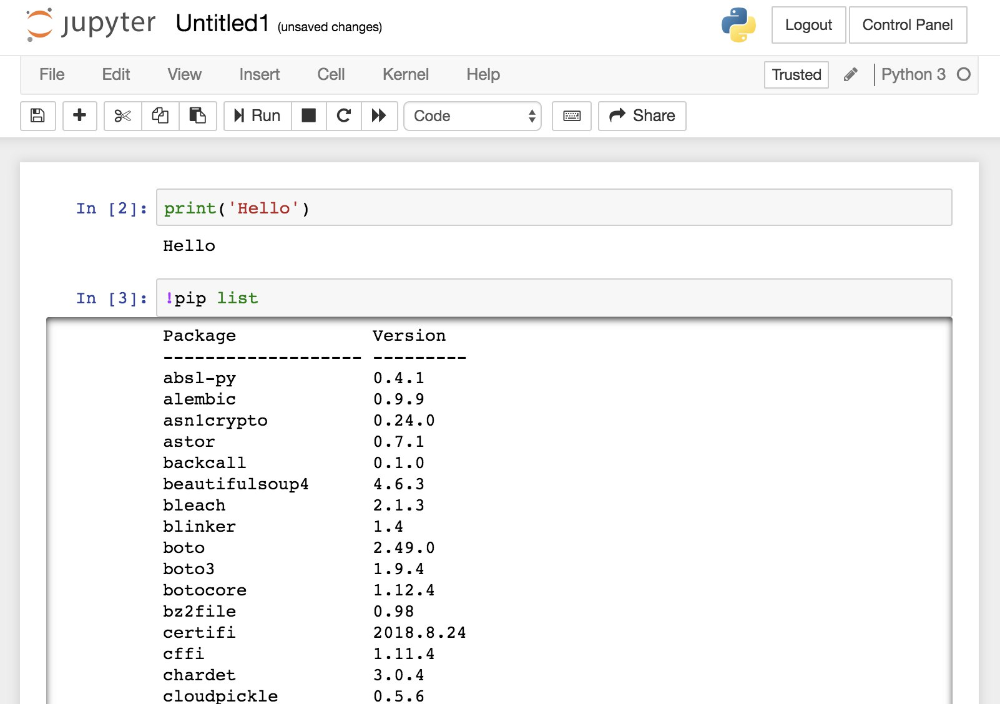

# How to Use Experimentor


## Share a Notebook
1. Sign in [Experimentor](https://experimentor-test.mentoracademy.org) with your Github account.

2. Create a notebook file.

    

    

3. Click the "Share" button. Experimentor will give you a code.

    

## Join a Notebook

- To join a notebook, click the "Join Notebook" button on the homepage and paste the code.

    

## Install Python Packages

- There are some common packages installed in Experimentor. To check them, open a notebook and type the following:

    

- If the package you need is not on this list, you could install by typing:

    ```
    !pip install __packageX__
    ```

## What if the notebook is not working?

Since Experimentor is still a research prototype, it might run into issues. If the Python code in your notebook is not working, please try to restart the kernel. If it doesn't work out, or you experience other issues, please contact April via Slack or email.